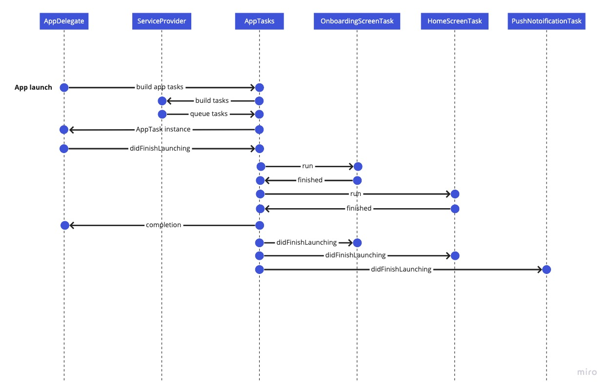

## Overview
Additions library provides an ordered way to perform application boot tasks. The main components of the boot process are:

* [AppTasks](#apptasks)
* [ServiceProvider](#serviceprovider)
* [AppTask](#apptask)
* [NoOpTask](#nooptask)

Here's example sequence diagram from an app launched using `AppTasks`:



To understand better each step, keep on reading.

## AppTasks
### Description
`AppTasks` provides an object that manages setup tasks when booting the application. When setup tasks are running, it buffers `AppDelegate` delegate method calls, when setup tasks are finished, it forwards buffered `AppDelegate` calls, and it keeps sending further `AppDelegate` calls to observing tasks.

### Example
You must create this object on your `SceneDelegate` or `AppDelegate` in order to forward application events.

```swift
class AppDelegate: UIResponder, UIApplicationDelegate {

  private var appServices = AppServices()
	/// In this case we are getting an instance of `AppTasks` by building it, but after it is built, we can also get it by calling: `AppTasks.shared`
	private lazy var tasks = AppTasks.build(serviceProviders: [AdditionsServices(), appServices]) {
        print("all tasks completed")
    }
	func application(_ application: UIApplication, didFinishLaunchingWithOptions launchOptions: [UIApplication.LaunchOptionsKey: Any]?) -> Bool {

		/// Calls to `didFinishLaunching` and other delegate methods must be redirected to the array of `tasks` we received from building an `AppTasks` object, so that they can be buffered and forwarded to the currently registered tasks. We will do the same for all `AppDeleagte` delegate calls.
		tasks.forEach {
			_ = $0.application?(application, didFinishLaunchingWithOptions: launchOptions)
		}
		return true
	}
}
```

## ServiceProvider
### Description
To take advantage of the `ServiceLocator` that `Additions` provides, you must create a subclass of `ServiceProvider`. It is in charge of building the necessary components for `AppTasks` to work.

It is also where we’ll define in which order tasks must be ran.

### Example
```swift
import Additions

class AppServices: ServiceProvider {
	private lazy var onboardingScreenTask = OnboardingScreenTask()
	private lazy var homeScreenTask = HomeScreenTask()
	private lazy var pushNotoificationTask = PushNotoificationTask()
	
	lazy var appTasks: [AppTask] = {
		/// We need to present onboarding screens before showing the home screen, so we add a dependency from `homeScreenTask` to `onboardingScreenTask` this way, `homeScreenTask` won't be ran until `onboardingScreenTask` calls the `setFinished()` method.
		homeScreenTask.addDependency(onboardingScreenTask)
		return [
			onboardingScreenTask,
		 	homeScreenTask, 
			pushNotoificationTask
		]
	}()

	/// `modules` method implementation is required by the `ServiceLoactor` protocol.
	func modules() -> [Register] {
		/// If we want to use `@Inject` to have the stored instance of a task injected to an other class, we can do so by registering it with the `ServiceLocator`.
		return [
			Register { homeScreenTask }
		]
	}
}
```

## AppTask
### Description
An `AppTask` is an NSOperation subclass that needs to be performed before any `AppDelegate` or `SceneDelegate` call is performed.

To create an `AppTask` you must provide an object that conforms to `AppTask` , overrides its `main()` method, and calls `setFinished()` when it finishes the process.

Since these tasks are NSOperations, you can create various dependencies between them, and when submitted to `AppTasks`, they can even execute in parallel if the dependencies are set up in that way.

### Example

```swift
/// Conform to `AppTask`
class OnboardingScreenTask: AppTask {
	private let onboardingNavigator: OnboardingNavigator
	init(onboardingNavigator: OnboardingNavigator) { ... }

	/// Override `main()`
	override func main() {
		/// Presents onboarding screens
		onboardingNavigator.navigate(completion: {
			/// Call `setFinisehd()` when onboarding is completed.
			self.setFinished()
		})
	}
}
```

### NoOpTask

### Description

A `NoOpTask` is a task that finishes immediately. The use of this kind of task is to receive and react to `AppDelegate` delegate calls. It will keep receiving these events throught the app’s lifecycle.

### Example

```swift
/// Conform to `AppTask`
class PushNotoificationTask: NoOpTask {
	private let pushService: PushService
	init(pushService: PushService) { ... }
	func application(
		_ application: UIApplication, 
		didRegisterForRemoteNotificationsWithDeviceToken deviceToken: Data) {
		pushService.application(
			application, 
			didRegisterForRemoteNotificationsWithDeviceToken: deviceToken
		)
	}
}
```
